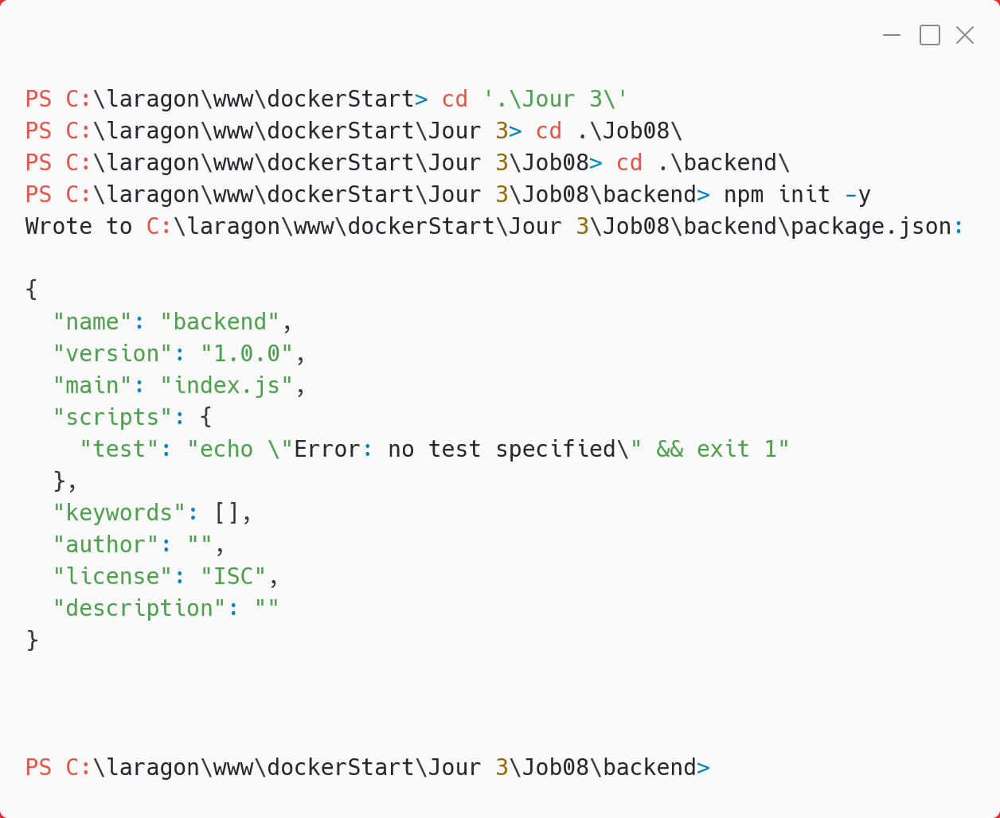
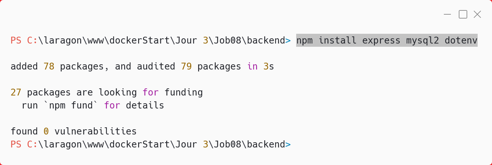
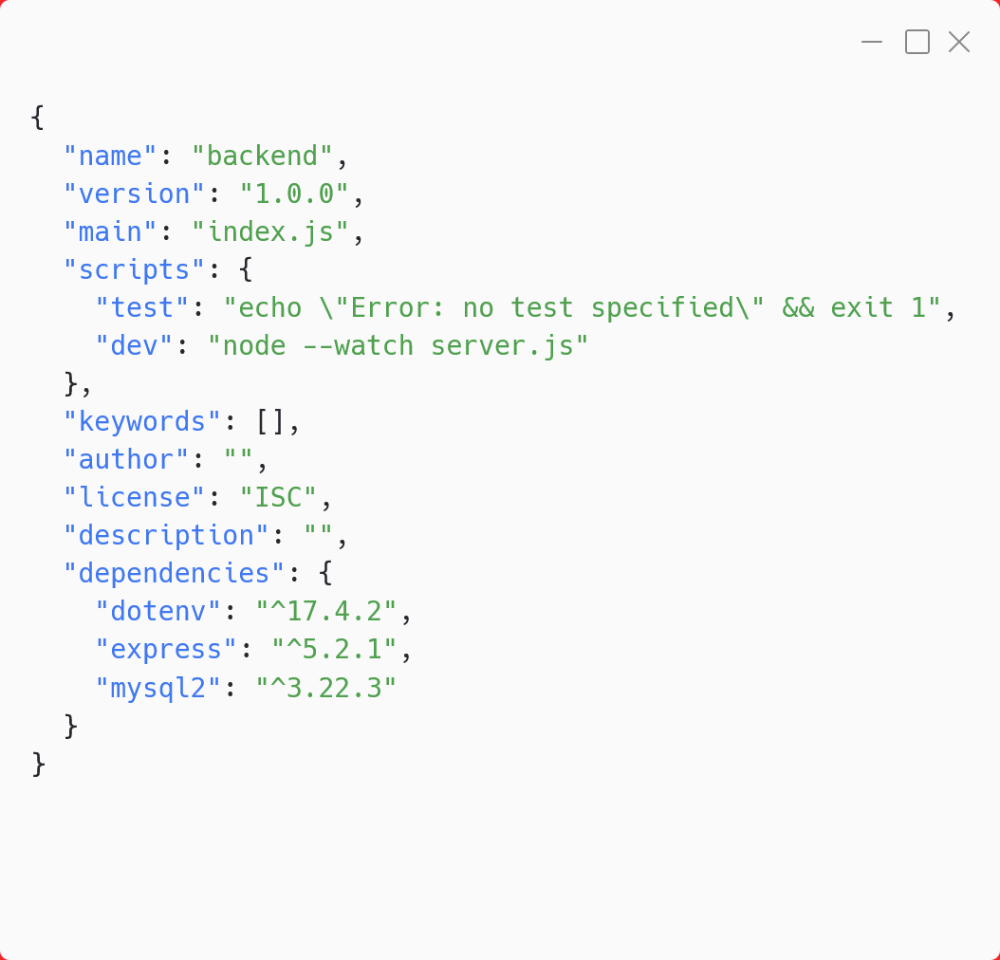
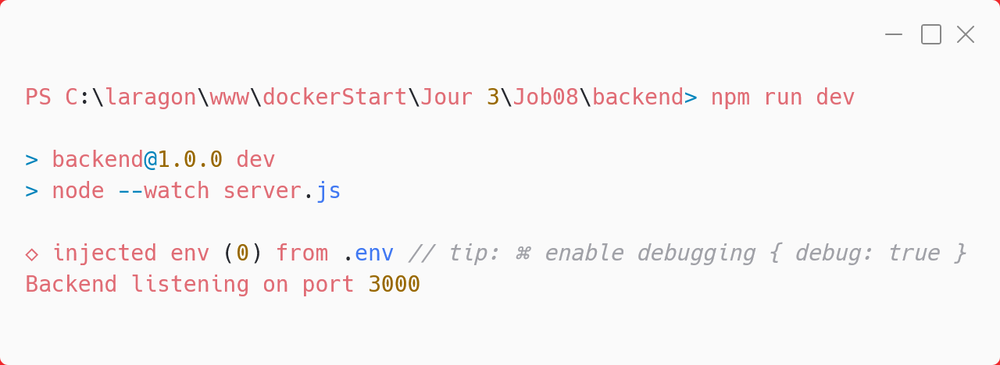
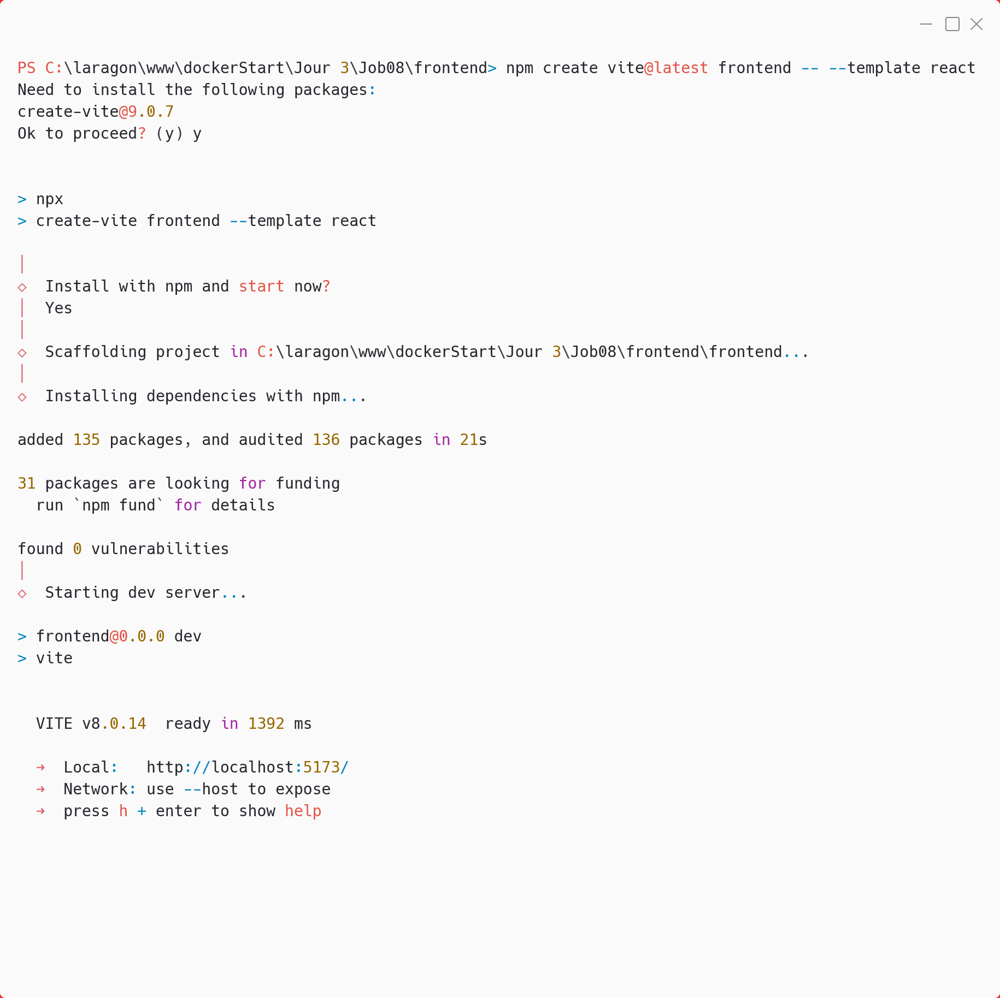
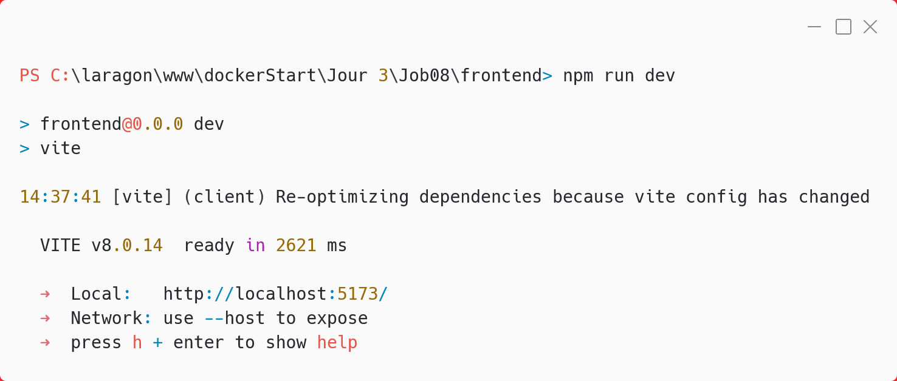

# Job08 — Initialisation du backend

## Création de la structure

- Création du dossier `Job08` et du sous-dossier `backend`.

## Étapes réalisées

### 1. Initialisation du projet backend

```sh
npm init -y
```

Cette commande crée un fichier `package.json` minimal dans le dossier backend.



### 2. Installation des dépendances

```sh
npm install express mysql2 dotenv
```

- `express` : framework web pour Node.js
- `mysql2` : client MySQL pour Node.js
- `dotenv` : gestion des variables d'environnement



### 3. Ajout du script de développement

Dans le fichier `package.json`, ajout du script :

```json
"dev": "node --watch server.js"
```

Ce script permet de lancer le serveur en mode hot reload (Node >= 18.11+).



### 4. Création du fichier server.js

J'ai créé le fichier `server.js` avec deux routes :

- `GET /` : retourne un JSON de bienvenue
- `GET /db-test` : teste la connexion à la base MySQL

### 5. Lancement du backend en mode développement

Après avoir créé `server.js`, j'ai lancé le backend en mode hot reload avec la commande :

```sh
npm run dev
```

Cela démarre le serveur et affiche dans le terminal :



On voit que le serveur écoute bien sur le port 3000 et que le hot reload est actif (Node --watch).

### 6. Création du frontend avec Vite + React

Dans le dossier Job08, j'ai créé le projet frontend avec la commande :

```sh
npm create vite@latest frontend -- --template react
```

Cela initialise un projet React moderne avec Vite dans le dossier frontend.



### 7. Lancement du frontend en mode développement

Après avoir configuré le frontend, je le lance avec :

```sh
npm run dev
```

Cela démarre le serveur Vite (généralement sur le port 5173) et permet de tester la connexion avec le backend.



## Phase 3 — docker-compose.yml

### 8. Service db (MySQL + healthcheck)

Le service `db` utilise l'image `mysql:8`, un volume persistant et un healthcheck pour vérifier que MySQL est vraiment prêt.

Points configurés :

- image `mysql:8`
- volume persistant `db_data:/var/lib/mysql`
- healthcheck avec `mysqladmin ping -h localhost`
- variables sensibles injectées depuis `.env`

### 9. Service backend (Node 20 + hot reload)

Le service `backend` est monté en bind mount et démarre en mode développement avec hot reload.

Points configurés :

- `build: ./backend`
- `command: npm run dev`
- bind mount `./backend:/app`
- exclusion des modules `- /app/node_modules`
- attente de la base via :
  - `depends_on`
  - `condition: service_healthy`

### 10. Service frontend (Vite + polling Windows/WSL)

Le service `frontend` lance Vite en mode dev avec accès réseau et polling activé pour Windows/WSL.

Points configurés :

- `build: ./frontend`
- `command: npm run dev -- --host 0.0.0.0`
- `CHOKIDAR_USEPOLLING=true`
- bind mount `./frontend:/app`
- exclusion des modules `- /app/node_modules`

## Variables d'environnement

Les paramètres sensibles et techniques sont externalisés dans `.env`.

Clés utilisées :

- `MYSQL_ROOT_PASSWORD`
- `MYSQL_DATABASE`
- `MYSQL_USER`
- `MYSQL_PASSWORD`
- `BACKEND_PORT`
- `FRONTEND_PORT`
- `DB_HOST`
- `DB_PORT`

Le fichier `.env.example` contient les mêmes clés sans valeurs sensibles.

## Vérification de la stack

Commandes principales :

```sh
docker compose up --build
docker compose ps
```

Vérifications attendues :

- `db` passe en statut healthy
- le backend démarre après la base
- le frontend est disponible sur le port 5173
- la route backend `/db-test` répond correctement
