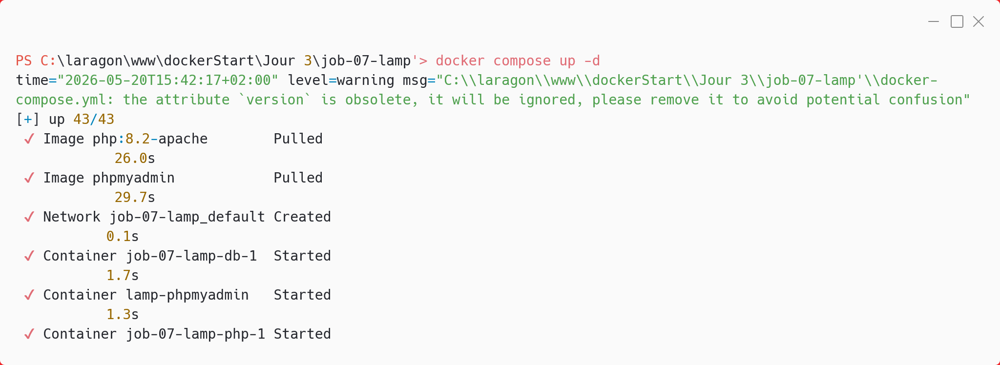
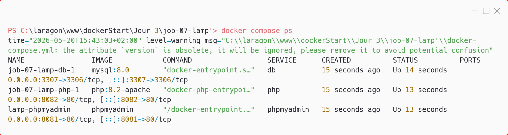
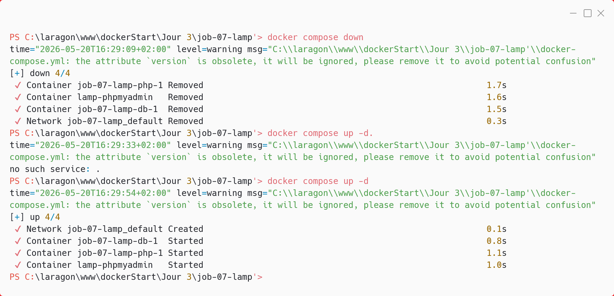
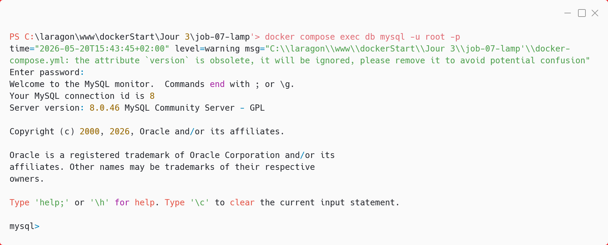
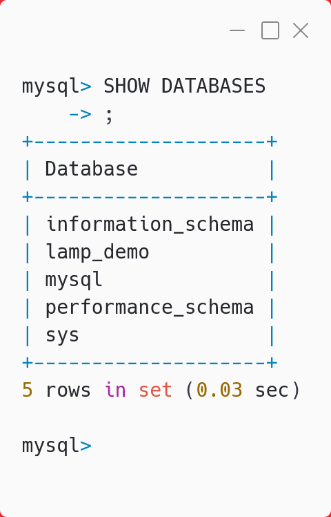

# job-07-lamp — Stack LAMP Docker Compose

## Présentation

Ce projet fournit un environnement de développement LAMP (Linux, Apache, MySQL, PHP) prêt à l’emploi via Docker Compose. Il permet de lancer en une commande :

- Un serveur PHP/Apache (php:8.2-apache)
- Une base de données MySQL 8 persistante
- Une interface phpMyAdmin pour explorer la base

## Prérequis

- Docker Desktop installé (Windows, Mac, Linux)

## Structure du projet

```
job-07-lamp/
├── docker-compose.yml
├── .env (à créer, voir .env.example)
├── .env.example
├── .gitignore
├── img/
│   ├── 01_docker_compose_up_-d.png
│   ├── 02_docker_compose_ps.png
│   ├── 05_docker_compose_down_docker_compose_up_-d.png
│   ├── 03_docker_compose_exec_db_mysql_-u_root_-p.png
│   └── 04_SHOW_DATABASES.png
├── README.md
└── src/
  └── index.php
```

## Lancement de la stack

Dans le dossier du projet :

```bash
docker compose up -d
```



Vérifiez que les conteneurs sont bien lancés :

```bash
docker compose ps
```



---

## Test de la persistance des données

Pour tester la persistance MySQL :

1. Créez une table dans la base lamp_demo (via phpMyAdmin ou ligne de commande).
2. Arrêtez la stack puis relancez-la :

```bash
docker compose down
docker compose up -d
```



La table doit toujours être présente après redémarrage.

---

## Connexion à MySQL en ligne de commande

```bash
docker compose exec db mysql -u root -p
```



Puis, pour afficher les bases :

```sql
SHOW DATABASES;
```



## Arrêt de la stack

```bash
docker compose down
```

## Réinitialiser la base de données (supprime toutes les données !)

```bash
docker compose down -v
```

## Accès aux services

- **Application PHP** : [http://localhost:8080](http://localhost:8080) (phpinfo + test connexion MySQL)
- **phpMyAdmin** : [http://localhost:8081](http://localhost:8081)
  - Utilisateur : `root` / Mot de passe : `rootpassword`
  - ou `dev` / `secret`

## Ports utilisés

- 8080 : application PHP
- 8081 : phpMyAdmin
- 3307 : MySQL (accès local, optionnel)

## Variables d’environnement

- Les variables sensibles sont à placer dans `.env` (non versionné)
- Un exemple est fourni dans `.env.example`
- `.env` doit être listé dans `.gitignore`

## Test de persistance

1. Créez une table dans `lamp_demo` via phpMyAdmin
2. Faites `docker compose down` puis `docker compose up -d`
3. Vérifiez que la table est toujours là
4. Pour tout réinitialiser : `docker compose down -v`

## Commandes utiles

- Voir les logs d’un service :
  ```bash
  docker compose logs php
  docker compose logs db
  docker compose logs phpmyadmin
  ```
- Accéder au shell MySQL :
  ```bash
  docker compose exec db mysql -u root -prootpassword
  ```

## Remarques

- Le code PHP est monté dynamiquement depuis `./src` : toute modification est prise en compte instantanément.
- La communication entre services se fait via le nom du service (ex : `db` pour MySQL).

---

> Pour toute question ou blocage, consultez la documentation officielle Docker Compose ou demandez au formateur.
