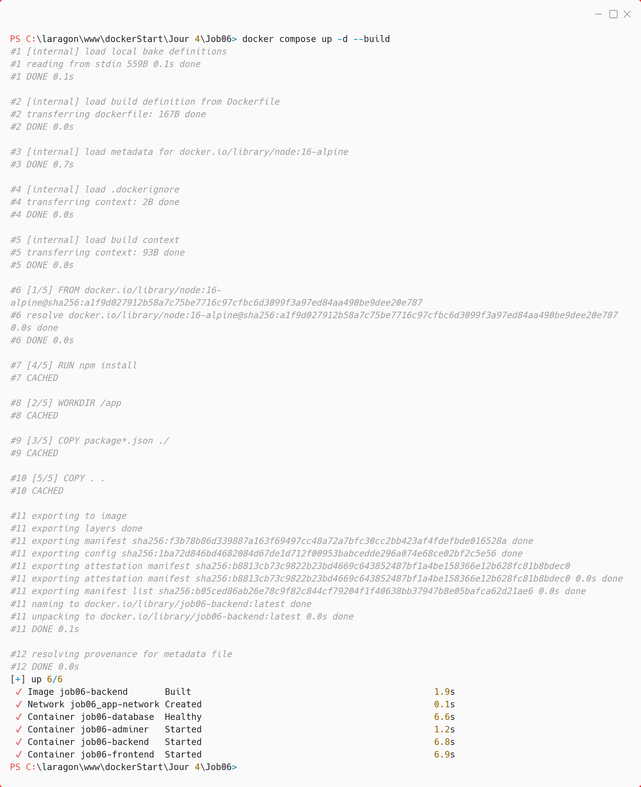
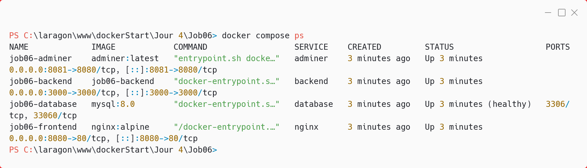
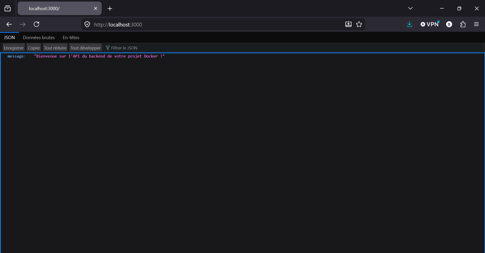
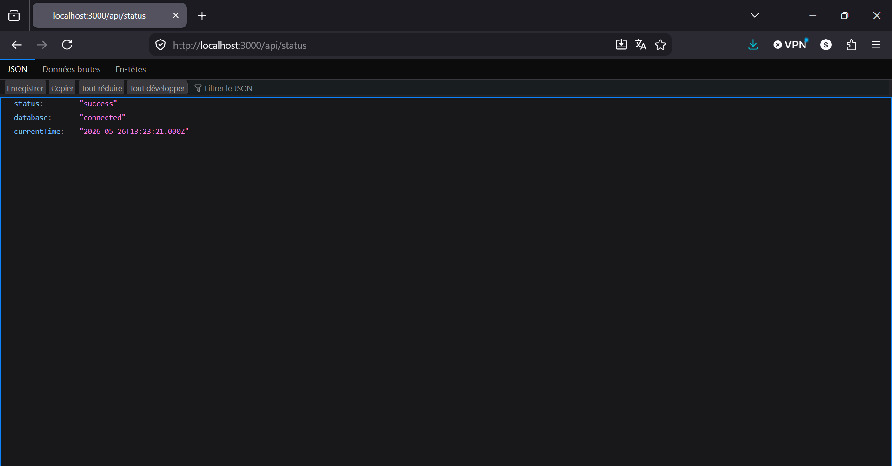
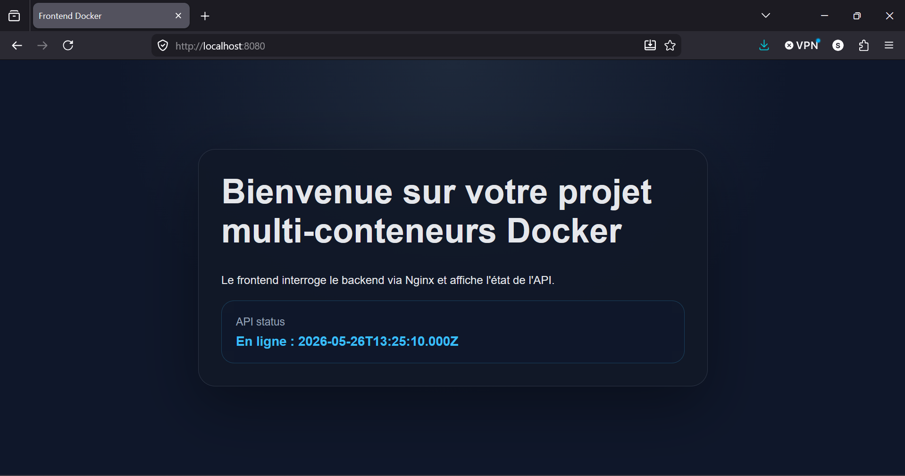
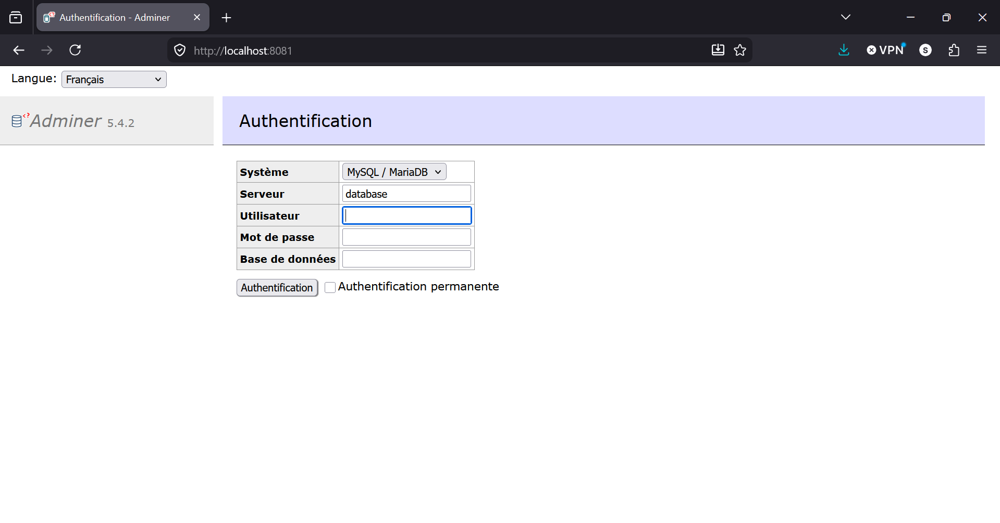
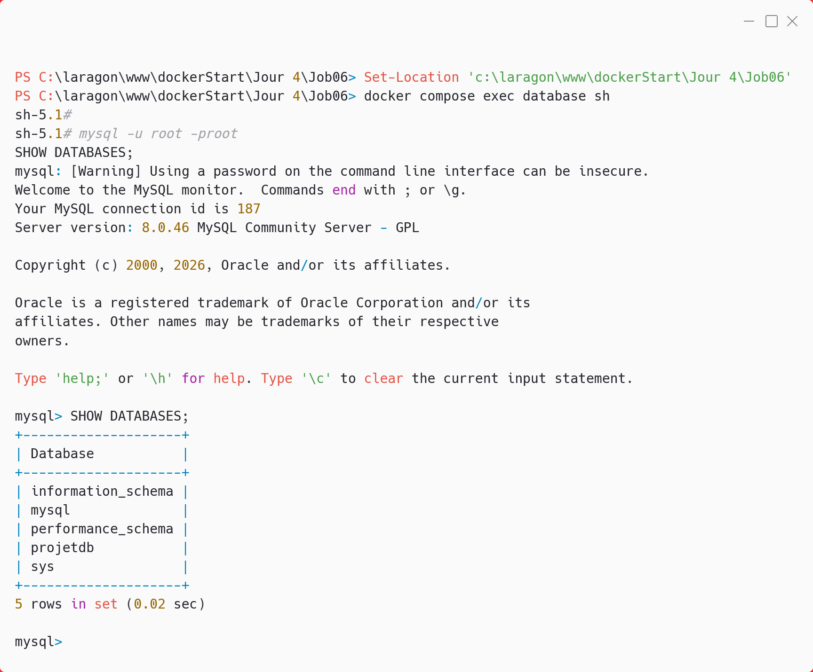
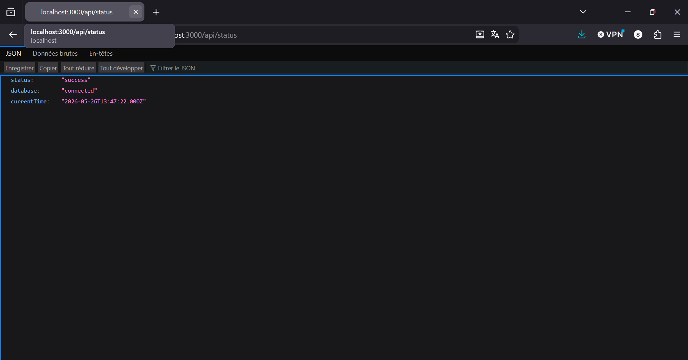

# Job 06 - Réseautage Docker Compose

Ce projet met en place une application multi-conteneurs avec MySQL, un backend Node.js, un frontend servi par Nginx et l’interface d’administration Adminer.

## Architecture

- `database` : MySQL 8, exposé sur le port `3306`
- `backend` : API Node.js 16-alpine, exposée sur le port `3000`
- `nginx` : frontend statique servi par Nginx, exposé sur le port `8080`
- `adminer` : interface graphique d’administration BDD, exposée sur le port `8081`

## Structure

```text
Job06/
├── docker-compose.yml
├── backend/
│   ├── Dockerfile
│   ├── package.json
│   └── server.js
├── frontend/
│   └── index.html
├── nginx/
│   └── nginx.conf
└── images/
```

## 1) Démarrer la stack

```bash
docker compose up -d --build
```

Capture attendue : lancement des 4 services.



## 2) Vérifier les conteneurs

```bash
docker compose ps
```

Capture attendue : état des services `database`, `backend`, `nginx` et `adminer`.



## 3) Tester le backend

Ouvre le navigateur sur :

- `http://localhost:3000`
- `http://localhost:3000/api/status`

La route `/` renvoie un message de bienvenue.
La route `/api/status` interroge MySQL et renvoie l’heure courante.





## 4) Tester le frontend

Ouvre le navigateur sur :

- `http://localhost:8080`

Le frontend récupère l’état de l’API via Nginx et affiche le statut de la base de données.



## 5) Ouvrir Adminer

Ouvre le navigateur sur :

- `http://localhost:8081`

Identifiants attendus :

- Serveur : `database`
- Utilisateur : `root`
- Mot de passe : `root`
- Base de données : `projetdb`



## 6) Vérifier l’accès à MySQL en terminal

L’URL `http://localhost:3306` ne fonctionne pas dans un navigateur, car MySQL n’est pas un service HTTP. Le bon moyen est d’entrer dans le conteneur puis de lancer le client MySQL.

```bash
docker compose exec database sh
mysql -u root -proot
SHOW DATABASES;
exit
exit
```

Le premier `exit` quitte le shell MySQL, le second quitte le shell du conteneur.



## 7) Vérifier la connexion backend -> base de données

La route suivante valide la connexion entre les services :

```bash
curl http://localhost:3000/api/status
```

Réponse attendue : un JSON contenant `status` et `currentTime`.



## 8) Rendu attendu

- Captures d’écran à chaque étape importante
- Images stockées dans le dossier `images/`
- Readme structuré en Markdown
- Commits réguliers avec des messages explicites
- Projet partagé sur GitHub

## Commandes utiles

```bash
docker compose logs -f backend
docker compose logs -f database
docker compose down
```
