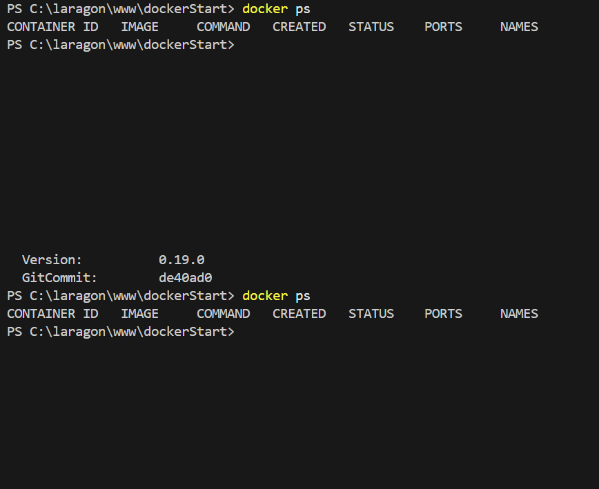

# Jour 1 – Job 01 : Docker

## 1) Installation & prérequis

- Docker installé (version : `docker --version`).
- Compte Docker créé et connecté via `docker login`.

**Capture 1 : installation / connexion**


`<-- absence de capture normale`

## 2) Commandes testées & résultats

### 2.1 Vérification de l’installation

- `docker --version`
- `docker info`

**Capture 2 : sortie de `docker info`**


### 2.2 Liste des conteneurs et images

**Capture 3 : `docker ps` / `docker images`**



- `docker ps`
- `docker images`

## 3) Récupération de l’image Docker

- Image récupérée : `docker/welcome-to-docker`
- Commande utilisée :
  ```bash
  docker pull docker/welcome-to-docker
  ```

**Capture 4 : `docker pull`**

``

## 4) Lancement du conteneur

- Commande utilisée :
  ```bash
  docker run -it --rm -p 8080:80 docker/welcome-to-docker
  ```
- Accès depuis le navigateur : `http://localhost:8080`

**Capture 5 : conteneur en cours d'exécution (commande + navigateur)**

``

## 5) Arrêt et suppression

- Arrêt du conteneur :

  ```bash
  docker stop <CONTAINER_ID>
  ```

  **Capture 6 : arrêt du conteneur**

  ``

- Suppression du conteneur :

  ```bash
  docker rm <CONTAINER_ID>
  ```

  **Capture 7 : suppression du conteneur**

  ``

- Suppression de l’image :

  ```bash
  docker image rm docker/welcome-to-docker
  ```

  **Capture 8 : suppression de l’image**

  ``

## 6) Commandes supplémentaires (exemples)

- Supprimer plusieurs conteneurs :

  ```bash
  docker rm <CONTAINER_ID_1> <CONTAINER_ID_2>
  ```

- Supprimer tous les conteneurs arrêtés :

  ```bash
  docker rm $(docker ps -a -q)
  ```

- Forcer la suppression d’un conteneur actif :

  ```bash
  docker rm -f <CONTAINER_ID>
  ```

- Supprimer toutes les images inutilisées :
  ```bash
  docker image prune -a
  ```

---

## 7) Notes / erreurs rencontrées

- [Remplacer cette section avec vos notes et les erreurs rencontrées, puis expliquer ce que vous avez fait pour corriger ou comprendre.]
