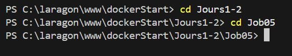
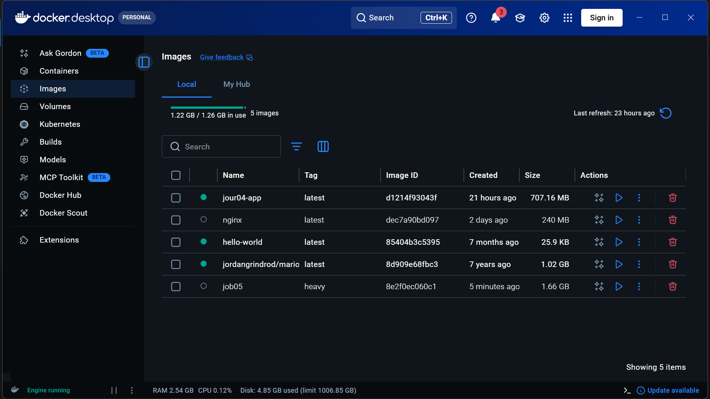
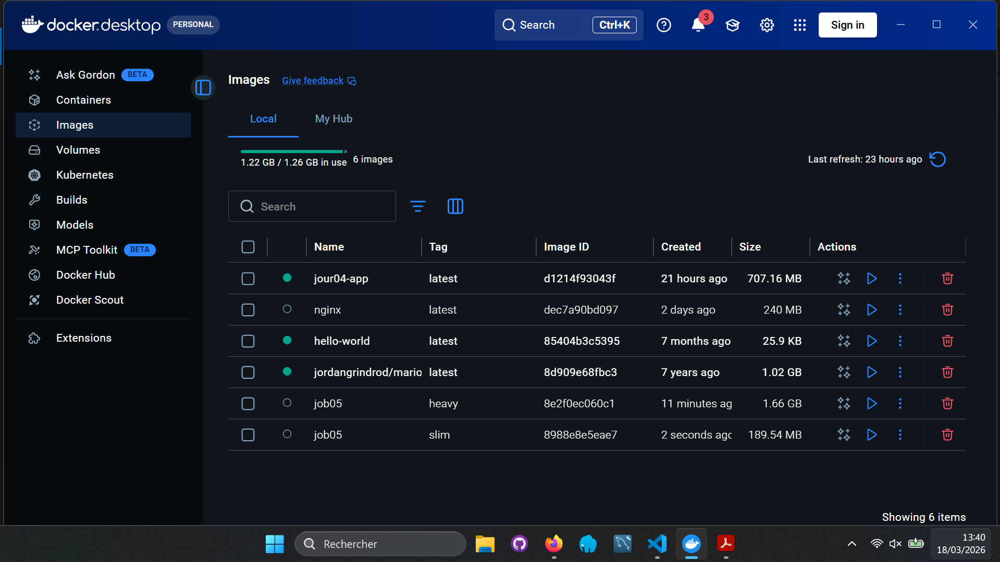
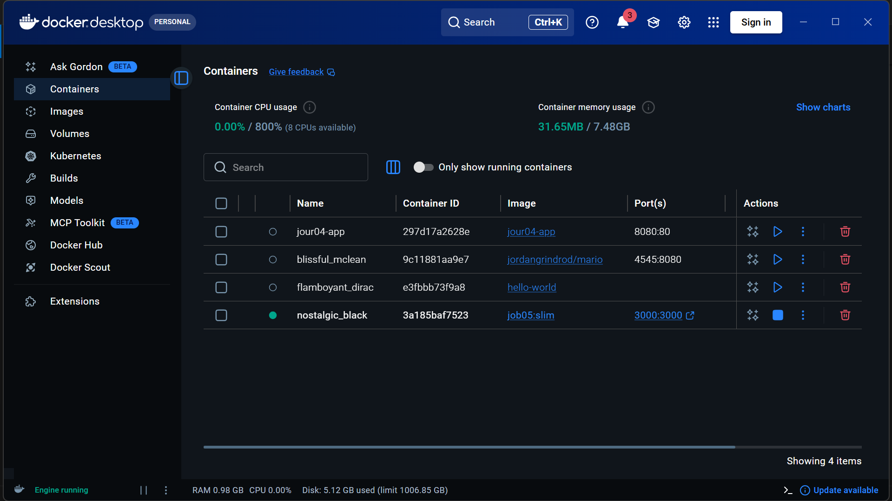
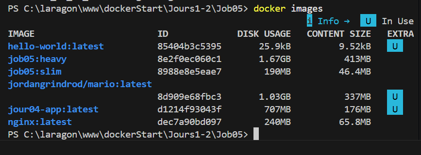
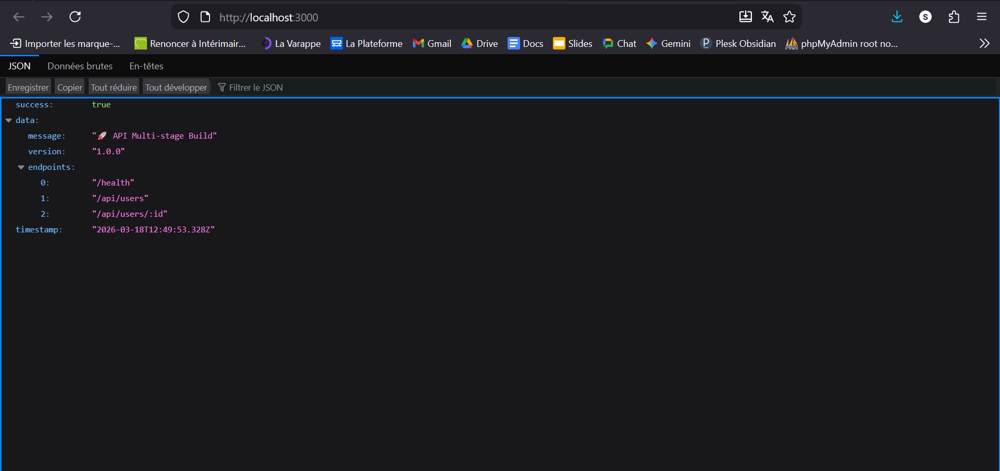

# Job05 – Multi-stage Build (Docker)

Ce dossier contient une API Node.js TypeScript et plusieurs Dockerfiles pour **comparer la taille des images** (image classique vs image multi-stage).

## 📁 Structure

- `Dockerfile.heavy` : build “classique” (toutes les dépendances + build dans la même image)
- `Dockerfile.slim` : build multi‑stage (image finale légère)
- `Dockerfile.dev` : image pour développement (ts-node)
- `images/` : captures d’écran des étapes (build + comparaison des tailles)

---

## 🧪 Étapes principales (conseillées)

1. Se placer dans le dossier :
   ```powershell
   cd c:\laragon\www\dockerStart\Jours1-2\Job05
   ```
2. Builder l’image “heavy” :
   ```powershell
   docker build -f Dockerfile.heavy -t job05:heavy .
   ```
3. Builder l’image “slim” :
   ```powershell
   docker build -f Dockerfile.slim -t job05:slim .
   ```
4. Comparer les tailles :
   ```powershell
   docker images
   ```
5. Lancer le container “slim” pour tester :
   ```powershell
   docker run --rm -p 3000:3000 job05:slim
   ```

---

## 📸 Captures d’écran (exemples)












