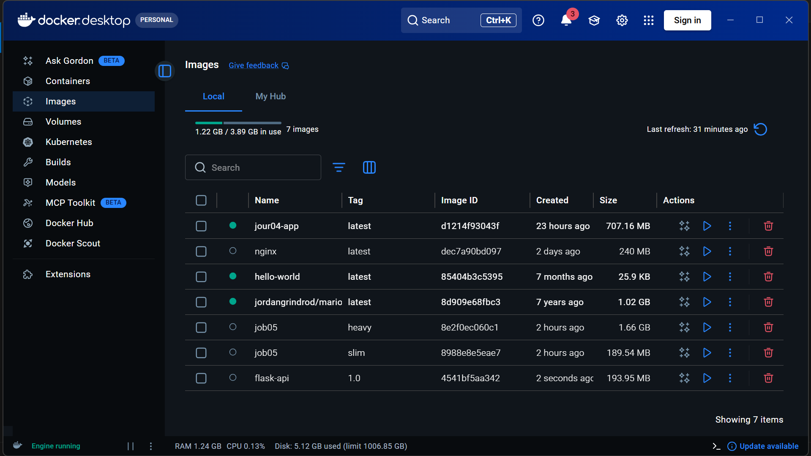
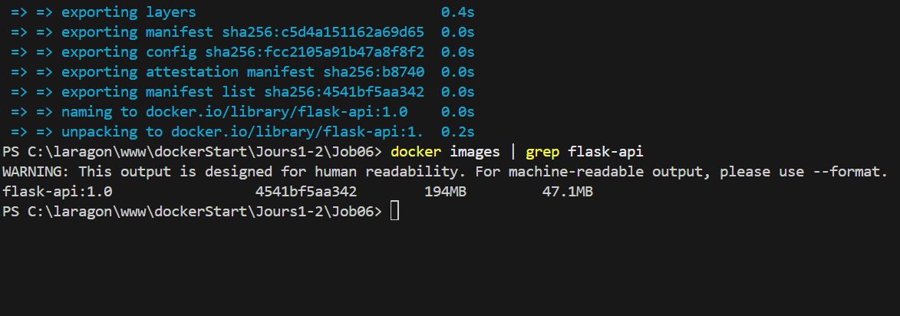
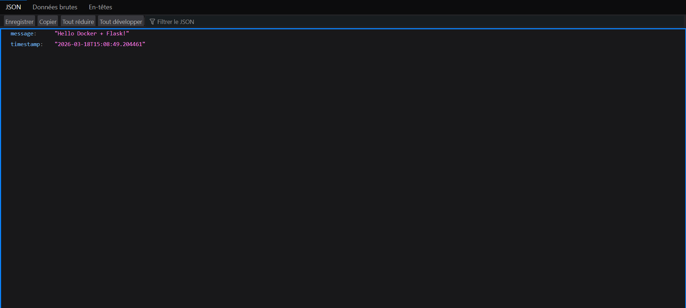
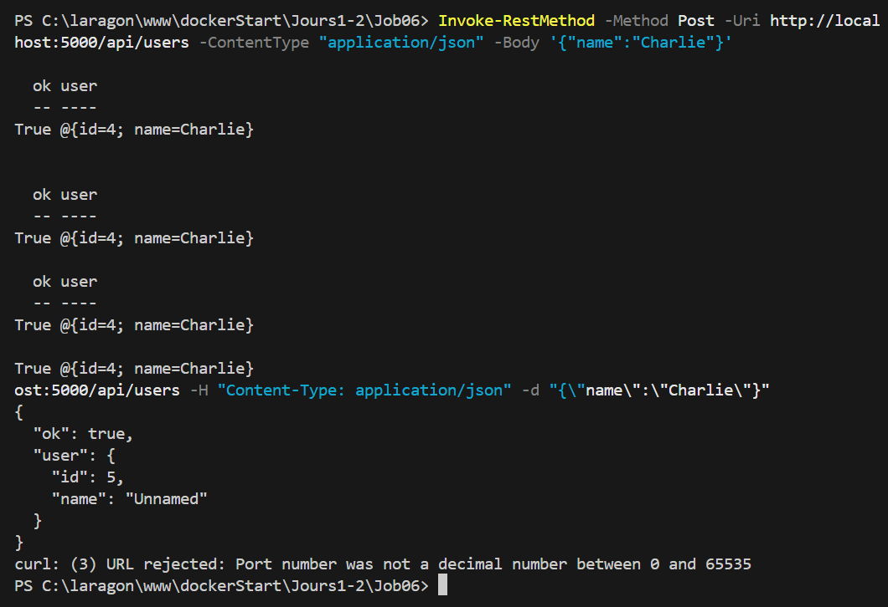
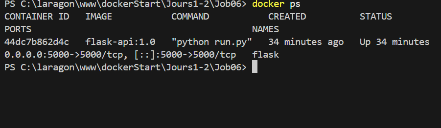
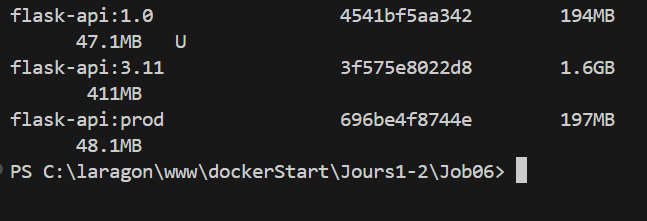

# Job 06 — API Flask dans Docker

Ce dépôt contient une petite API Flask exposée dans un conteneur Docker.

## 1) Build de l’image (dev)

```bash
docker build -t flask-api:1.0 .
```

<div style="display: inline-block; border: 3px solid yellow; padding: 4px;">
  
</div>

## 2) Lancer le container

```bash
docker run -d -p 5000:5000 --name flask flask-api:1.0
```

## 3) Vérifier que l’image existe

```bash
docker images | grep flask-api
```

<div style="display: inline-block; border: 3px solid yellow; padding: 4px;">
  
</div>

## 4) Tester l’API (GET)

Ouvre un navigateur sur :

- `http://localhost:5000/`
- `http://localhost:5000/api/users`

<div style="display: inline-block; border: 3px solid yellow; padding: 4px;">
  
</div>

## 5) Tester l’API (POST)

La route **POST `/api/users`** est disponible et ajoute un utilisateur en mémoire.

```bash
curl -X POST http://localhost:5000/api/users \
  -H "Content-Type: application/json" \
  -d '{"name":"Charlie"}'
```

Réponse :

```json
{
  "ok": true,
  "user": { "id": 3, "name": "Charlie" }
}
```

<div style="display: inline-block; border: 3px solid yellow; padding: 4px;">
  
</div>

## 6) (Optionnel) Vérifier que le container tourne

```bash
docker ps
```

<div style="display: inline-block; border: 3px solid yellow; padding: 4px;">
  
</div>

Cette capture montre le container `flask-api:1.0` en cours d’exécution et le mapping du port `5000`.

## 7) Build production (Gunicorn)

La version production utilise Gunicorn (plus adaptée que le serveur dev de Flask).

```bash
docker build -f Dockerfile.prod -t flask-api:prod .
```

## 8) Comparer les tailles d’images

Builder aussi avec `python:3.11` (non-slim) permet de comparer les tailles :

```bash
docker build -t flask-api:3.11 -f Dockerfile .
docker build -t flask-api:3.11-slim -f Dockerfile.prod .

docker images | grep flask-api
```

<div style="display: inline-block; border: 3px solid yellow; padding: 4px;">
  
</div>

## 9) Rendu / GitHub

- Code source complet (`app/`, `run.py`, `requirements.txt`)
- Dockerfile commenté
- Capture : API qui répond (GET + POST)
- Push sur GitHub
