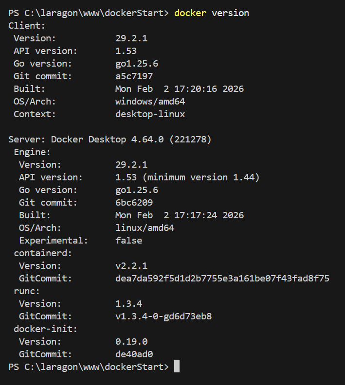
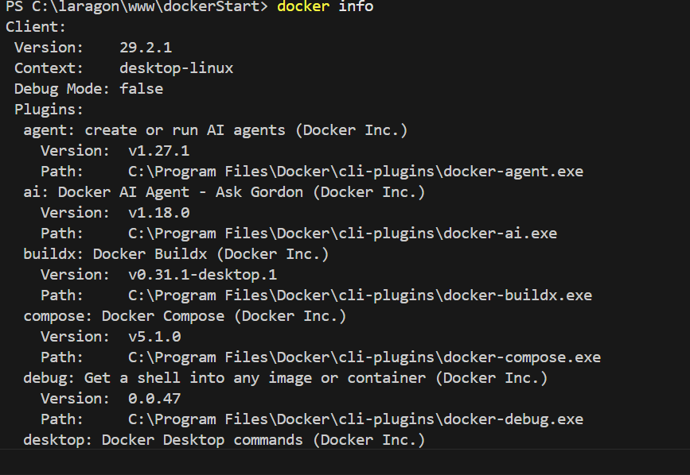
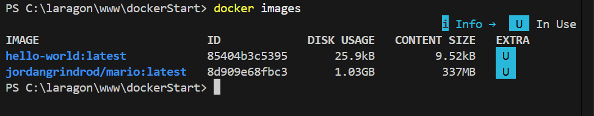
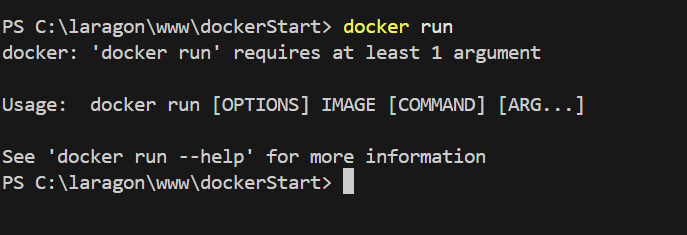
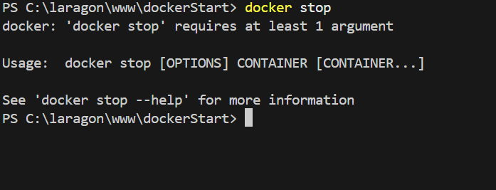
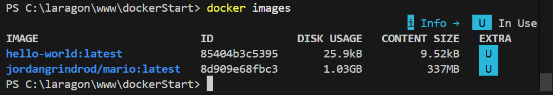

Vérifier la version d'installation de docker avec la commande
- docker --version

Tester les commandes de base dans le terminal :
- docker info

- docker ps

- docker images

- docker run

- docker stop

- docker pull

- docker images

Arrêter votre container :
- docker stop <Container_ID>

Supprimer votre container :
- docker rm <Container_ID>

Supprimer l’image Docker :
- docker image rm <nom_image>

Supprimer le container "ABC" :
- docker rm ABC

Supprimer plusieurs conteneurs :
- docker rm $(docker ps -a -q)
