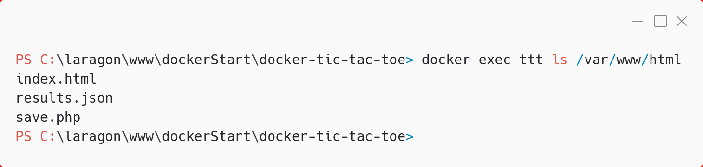
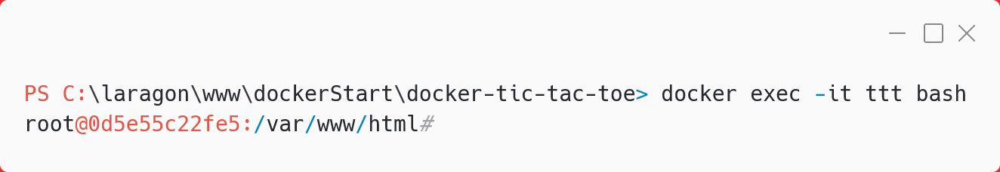
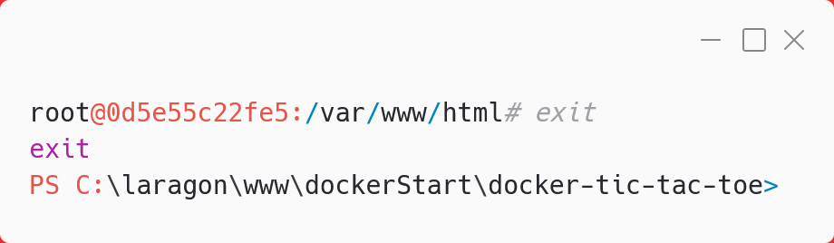
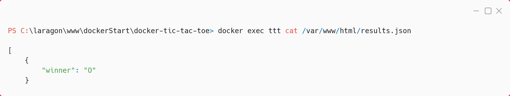
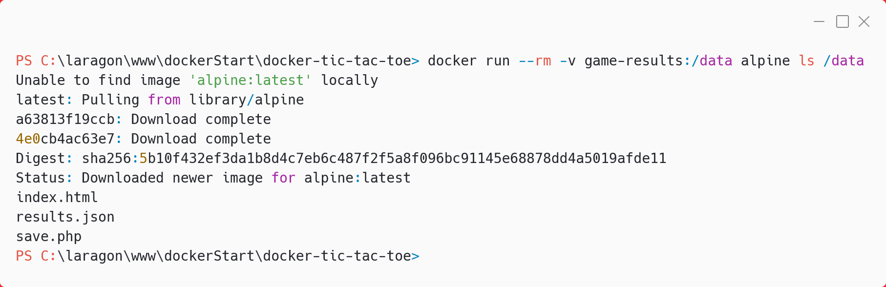

# Récapitulatif visuel Docker Tic Tac Toe

Ce document présente uniquement les captures d'écran (01 à 13) et leur commentaire associé, dans l'ordre chronologique du déroulé Docker.

---

## 01. Build de l'image


Commande :

```bash
docker build -t tictactoe .
```

---

## 02. Présentation du Dockerfile


Commande :

```bash
docker images
```

---

## 03. Création du volume Docker


Commande :

```bash
docker volume create game-results
```

---

## 04. Vérifier les volumes existants


Commande :

```bash
docker volume ls
```

---

## 05. Inspecter le volume


Commande :

```bash
docker volume inspect game-results
```

---

## 06. Lancement du conteneur


Commande :

```bash
docker run -d -p 8080:80 -v game-results:/var/www/html --name ttt tictactoe
```

---

## 07. Vérifier que le conteneur tourne


Commande :

```bash
docker ps
```

---

## 08. Voir le contenu du conteneur


Commande :

```bash
docker exec ttt ls /var/www/html
```

---

## 09. Shell interactif dans le conteneur


Commande :

```bash
docker exec -it ttt bash
```

---

## 10. Quitter le shell interactif


Commande :

```bash
exit
```

---

## 11. Lire le contenu de results.json


Commande :

```bash
docker exec ttt cat /var/www/html/results.json
```

---

## 12. Voir le contenu du volume (méthode 1)


Commande :

```bash
docker exec ttt ls /var/www/html
```

---

## 13. Voir le contenu du volume (méthode 2)


Commande :

```bash
docker run --rm -v game-results:/data alpine ls /data
```

---
