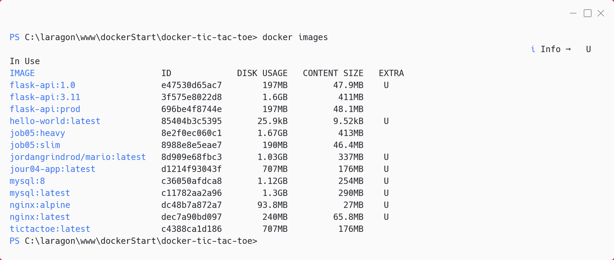
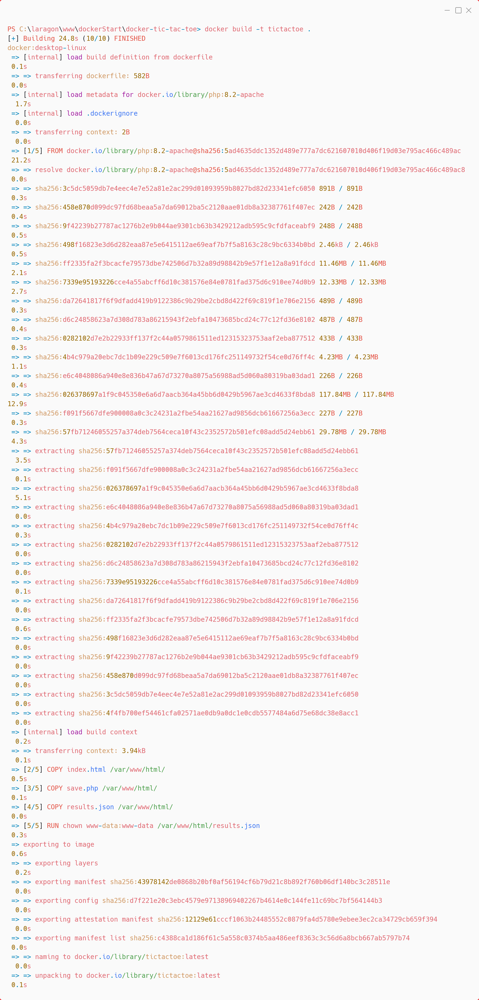
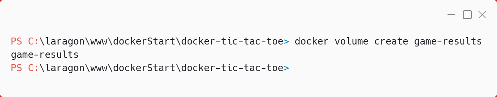
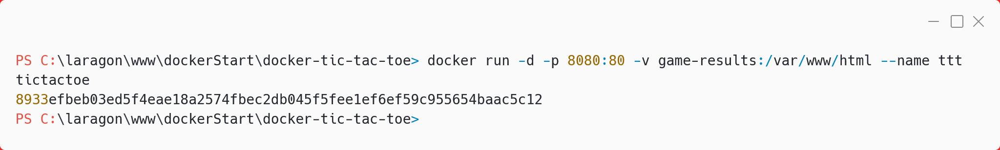
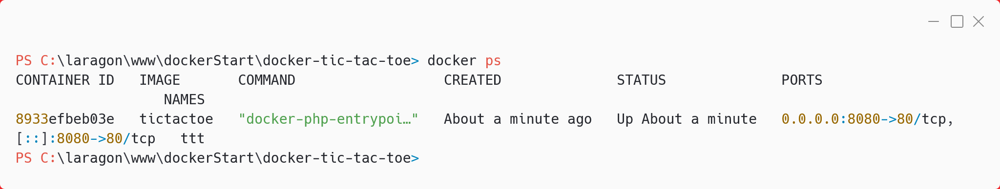
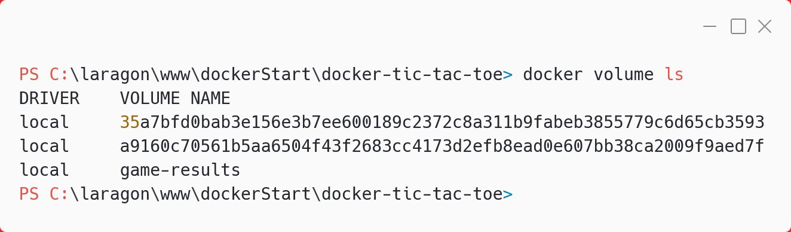
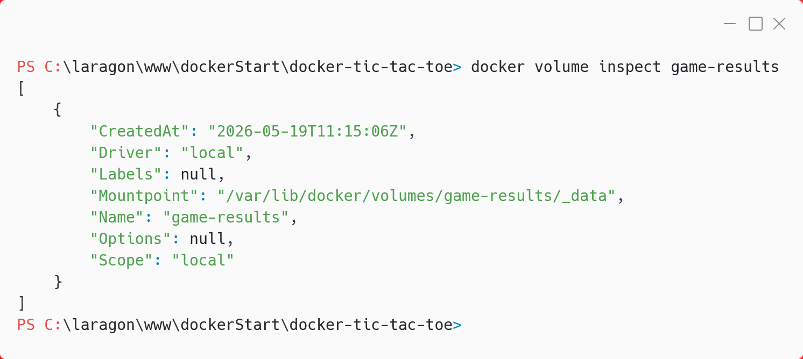

# Tic Tac Toe Docker

Petit projet Docker pour containeriser un jeu de morpion avec persistance des résultats via un volume nommé.

---

## 1. Arborescence du projet

```text
docker-tic-tac-toe/
├── Dockerfile
├── index.html
├── save.php
├── results.json
├── images/
│   ├── 01_build.png
│   ├── 02_images.png
│   ├── 03_create-volume.png
│   ├── 04_verifier-volume.png
│   ├── 05_inspecter-volume.png
│   ├── 06_docker-run.png
│   └── 07_verifier-conteneur-tourne.png
└── README.md
```

Le dossier contient :

- `Dockerfile` : instructions de build
- `index.html` : page du jeu (HTML/CSS/JS)
- `save.php` : endpoint PHP pour enregistrer les scores
- `results.json` : stockage des résultats (initialement : [])
- `images/` : captures d'écran du projet

---

## 2. Le Dockerfile

```dockerfile
FROM php:8.2-apache
COPY index.html /var/www/html/
COPY save.php /var/www/html/
COPY results.json /var/www/html/
RUN chown www-data:www-data /var/www/html/results.json
EXPOSE 80
```



---

## 3. Construction de l'image

Commande utilisée :

```bash
docker build -t tictactoe .
```



---

## 4. Création du volume Docker

Commande utilisée :

```bash
docker volume create game-results
```



---

## 5. Lancement du conteneur

Commande utilisée :

```bash
docker run -d -p 8080:80 -v game-results:/var/www/html --name ttt tictactoe
```



Accède ensuite à [http://localhost:8080](http://localhost:8080) pour jouer.

---

## 6. Vérifications et tests

### Voir les fichiers dans le conteneur

```bash
docker ps
```



### Lire le contenu du volume

```bash
docker volume ls
```



### Inspecter le volume (détail)

```bash
docker volume inspect game-results
```



### Jouer et vérifier la persistance

Après une partie, le fichier `results.json` est mis à jour :

```bash
docker exec ttt cat /var/www/html/results.json
```

<!-- Ajoute ici une capture du contenu de results.json si disponible, par exemple : -->
<!--  -->

---

## 7. Nettoyage

Arrêter et supprimer le conteneur :

```bash
docker stop ttt
docker rm ttt
```

Supprimer le volume (optionnel) :

```bash
docker volume rm game-results
```

Supprimer l'image (optionnel) :

```bash
docker rmi tictactoe
```

---

## 8. Checklist du rendu

- [x] Repo GitHub public ou partagé
- [x] Dossier `images/` avec captures numérotées (01-, 02-, ...)
- [x] Une capture par commande importante
- [x] Du texte d'explication entre chaque capture
- [x] Commits réguliers avec des messages clairs
- [x] Capture finale du contenu de `results.json`

---

## 9. Pièges à éviter

- Port déjà utilisé : changer 8080 en 8081 ou stopper le conteneur qui occupe le port
- Conteneur déjà existant : supprimer ou renommer avant de relancer
- Volume vide au premier montage : Docker copie les fichiers du conteneur dans le volume
- Sur Windows : privilégier PowerShell, WSL2 ou Git Bash

---

## 10. Ressources utiles

- [Documentation Docker](https://docs.docker.com/)
- [Image php:8.2-apache](https://hub.docker.com/_/php)
- [Guide Dockerfile IONOS](https://www.ionos.fr/digitalguide/serveur/know-how/dockerfile/)

---

Projet pédagogique – Docker, PHP, Apache, HTML/JS

docker build -t tic-tac-toe . 2. Lancement du conteneur

docker run -d -p 8080:80 --name ttt tic-tac-toe
Accède ensuite à http://localhost:8080 pour jouer.

Fonctionnement
Le jeu s’affiche dans le navigateur.
À chaque partie, le score est envoyé à save.php et stocké dans results.json.
Le conteneur expose le port 80 (mappé ici sur 8080).
Exemple de Dockerfile

FROM php:8.2-apacheCOPY index.html /var/www/html/COPY save.php /var/www/html/COPY results.json /var/www/html/RUN chown www-data:www-data /var/www/html/results.jsonEXPOSE 80
Auteur
Projet pédagogique – Docker, PHP, Apache, HTML/JS

Veux-tu que je remplace le contenu de ton README.md par cette version ? (Je peux aussi l’adapter selon tes préférences.)

GPT-4.1 • 0x
